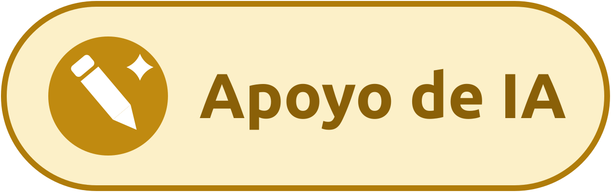
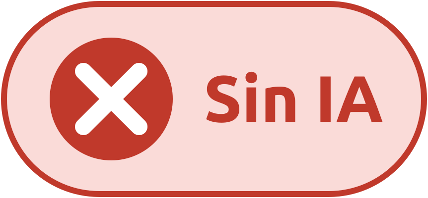

# Ciencia de Datos II · TC2002B.651

Repositorio del curso de Ciencia de Datos II de la licenciatura en Transformación Pública del Tecnológico de Monterrey, periodo agosto–diciembre de 2026.

---

## De qué trata el curso

El curso enseña a convertir texto en evidencia. Buena parte de lo que produce el sector público mexicano (versiones estenográficas, diarios de debates, actas, comunicados, quejas ciudadanas) es texto sin estructura, y ese material no se puede analizar con las herramientas que sirven para una tabla. Aquí se cubre el camino completo: cómo obtener ese texto, dónde guardarlo, cómo limpiarlo y cómo modelarlo para responder una pregunta de investigación.

El curso arranca con las herramientas de inteligencia artificial generativa, no como tema de moda sino como instrumento de trabajo: se usan durante todo el semestre para programar, para obtener datos y para clasificar texto, y también se estudian sus límites, sus sesgos y las implicaciones éticas y legales de usarlas. Después vienen las bases de datos, la limpieza de texto y, al final, el procesamiento de lenguaje natural.

El hilo que ordena el último bloque es una pregunta concreta: **quién logra imponer los temas de la discusión pública**. Las técnicas de clasificación, modelado de tópicos y análisis de sentimiento se enseñan como instrumentos para responderla, no como fines en sí mismos.

Al terminar, cada alumno debe ser capaz de tomar un corpus real, construir un flujo reproducible que lo procese, ajustar un modelo que diga algo defendible sobre él y comunicar el hallazgo a una audiencia que no programa.


## Propósito del curso: 

Que el estudiante diseñe, implemente y comunique soluciones de ciencia de datos de forma integral: programación en R, IA generativa, bases de datos, procesamiento de texto y análisis de lenguaje natural, orientados a la toma de decisiones basadas en evidencia.

---

## Temario del curso

### Bloque 1. Herramientas de inteligencia artificial generativa

| | Tema |
|---|---|
| 1.1 | Fundamentos de los modelos de lenguaje |
| 1.2 | Anatomía de un modelo de lenguaje |
| 1.3 | Capacidades y límites |
| 1.4 | Ética, sociedad y mercado laboral |
| 1.5 | Propiedad intelectual y política pública |
| 1.6 | Diseño de instrucciones (*prompting*) |
| 1.7 | Asistentes de código y programación asistida |
| 1.8 | Generación multimodal |
| 1.9 | Datos abiertos y descarga automatizada |
| 1.10 | Raspado web (*web scraping*) |
| 1.11 | Interfaces de programación y conexión con datos externos |

### Bloque 2. Bases de datos y arquitectura

| | Tema |
|---|---|
| 2.1 | Diseño y modelado de datos |
| 2.2 | Consulta con SQL |
| 2.3 | Bases no relacionales y arquitectura moderna |

### Bloque 3. Manejo y limpieza de texto

| | Tema |
|---|---|
| 3.1 | Fundamentos del dato textual |
| 3.2 | Manipulación de cadenas (*strings*) en R |
| 3.3 | Expresiones regulares (*regex*) |
| 3.4 | Tokenización y conteo |
| 3.5 | Limpieza de corpus |

### Bloque 4. Procesamiento de lenguaje natural y análisis de texto

| | Tema |
|---|---|
| 4.1 | La fijación de agenda como pregunta de investigación |
| 4.2 | Representación del texto y aprendizaje supervisado |
| 4.3 | Embeddings |
| 4.4 | Modelado de tópicos |
| 4.5 | Análisis de polaridad y sentimiento |
| 4.6 | Visualización y comunicación de resultados |

---

## Evaluación

| Componente | Peso |
|---|---|
| Tareas | 20% |
| Exámenes | 30% |
| Reto | 50% |

Esta es una **propuesta de evaluación** y puede ajustarse al inicio del semestre. Los criterios de cada rubro, las rúbricas y las fechas de entrega se publican en Canvas y en este repositorio en cuanto queden en firme.

Sobre cada rubro conviene saber lo siguiente. 

* Las **tareas** son actividades de duración y extensión corta encaminadas a complementar el contenido de las clases, a repasar conceptos, a hacer ejercicios de aplicación o para revisar temas que no se llegarán a cubrir en las clases. 

* Los **exámenes** son tres, uno por periodo, y evalúan comprensión de conceptos, no memorización de sintaxis: interesa que el alumno sepa cuándo usar cada técnica y qué supone cada modelo, no que recuerde el nombre exacto de un argumento. 

* El **reto** es un proyecto integrador con socio formador, en equipo, que toma texto como insumo principal; se trabaja durante todo el semestre y se presenta al final ante el socio.

---

## Política de uso de inteligencia artificial

El curso enseña a usar estas herramientas, así que no las prohíbe. Lo que sí exige es que quede claro **cuánto y cómo** se usaron. Cada tarea y actividad del semestre viene marcada con una de estas tres etiquetas:

| Etiqueta | Qué significa |
|---|---|
|  | Se espera que resuelvas la tarea con inteligencia artificial generativa. Se entrega también la bitácora de instrucciones: qué pediste, qué falló y cómo lo corregiste. |
|  | Puedes apoyarte en la IA, pero el trabajo y el criterio son tuyos. Se declara en qué partes ayudó y se responde por el resultado. |
|  | La tarea se resuelve sin IA, porque lo que se evalúa es justo la habilidad que la herramienta sustituiría. |

---

## Requisitos técnicos

Hay que tener instalado y funcionando:

- **R** (versión 4.4 o superior) y un entorno de desarrollo, RStudio o Positron.
- **Git** y una cuenta de GitHub.
- **Una cuenta activa en un asistente de inteligencia artificial** con acceso a un modelo reciente.
- Paquetes de R que se usan durante el semestre: `tidyverse`, `rvest`, `httr2`, `jsonlite`, `DBI`, `duckdb`, `dbplyr`, `tidytext`, `udpipe`, `SnowballC`, `topicmodels`, `tidymodels`, entre otros que se sumen. 


---

## Estructura del repositorio

```
01_Presentaciones/    Diapositivas de cada sesión, en PDF
assets/               Imágenes del repositorio
```

Conforme avance el semestre se irán agregando las carpetas de código, datos de ejemplo y consignas de tareas.

---

## Recursos y lecturas

### Libros de referencia

- James, G., Witten, D., Hastie, T. y Tibshirani, R. (2021). *An Introduction to Statistical Learning with Applications in R* (2ª ed.). Springer. Disponible en <https://www.statlearning.com/>
- Hastie, T., Tibshirani, R. y Friedman, J. (2009). *The Elements of Statistical Learning* (2ª ed.). Springer.
- Jurafsky, D. y Martin, J. H. *Speech and Language Processing* (3ª ed., borrador). Disponible en <https://web.stanford.edu/~jurafsky/slp3/>
- Silge, J. y Robinson, D. (2017). *Text Mining with R: A Tidy Approach*. O'Reilly. Disponible en <https://www.tidytextmining.com/>
- Wickham, H., Çetinkaya-Rundel, M. y Grolemund, G. (2023). *R for Data Science* (2ª ed.). O'Reilly. Disponible en <https://r4ds.hadley.nz/>

### Artículos que se leen en clase

- McCombs, M. E. y Shaw, D. L. (1972). The Agenda-Setting Function of Mass Media. *Public Opinion Quarterly*, 36(2), 176-187.
- Blei, D. M., Ng, A. Y. y Jordan, M. I. (2003). Latent Dirichlet Allocation. *Journal of Machine Learning Research*, 3, 993-1022.
- Sievert, C. y Shirley, K. (2014). LDAvis: A Method for Visualizing and Interpreting Topics. *Proceedings of the Workshop on Interactive Language Learning, Visualization, and Interfaces*, 63-70.

### Cursos y material complementario

- Cursos de Anthropic sobre uso de modelos de lenguaje: <https://anthropic.skilljar.com/>
- Cursos de OpenAI sobre uso de ChatGPT: <https://openai.com/es-419/academy/codex/>
- Documentación de los paquetes de R que usa el curso, en <https://cran.r-project.org/> y en los sitios de cada paquete.
- Fuentes de datos abiertos que se trabajan en clase: INEGI (<https://www.inegi.org.mx/>) y datos.gob.mx (<https://datos.gob.mx/>).

---

## Profesores

Jorge Juvenal Campos Ferreira
Jose Manuel Toral
Bogdan G. Popescu


Contacto y horario de asesoría: mandar mensajes al correo institucional para agendar. 
